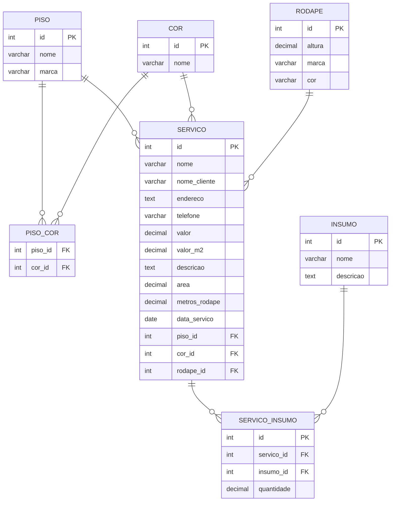

# Edis Pisos - Sistema de Gerenciamento de Serviços

Esse é um sistema completo desenvolvido para otimizar o fluxo de trabalho de uma empresa de revestimentos, pisos laminados e vinílicos. Ele permite gerenciar clientes, criar orçamentos detalhados com cálculo de áreas, vincular insumos necessários, rodapés e associar pisos a múltiplas cores de forma dinâmica através de "botões mágicos" de cadastro rápido na própria tela de criação.

## Funcionalidades Principais

- **Gerenciamento de Serviços/Orçamentos:** Cadastro e listagem de ordens de serviço por ordem cronológica (mais recentes primeiro), exibindo dados do cliente, endereço, metrage quadrada ($m^2$) e valores.
- **Cadastros Rápidos Integrados:** Modais interativos no front-end que permitem cadastrar novos Pisos, Cores, Rodapés ou Insumos sem perder o progresso do orçamento atual.
- **Relacionamento Dinâmico (Many-to-Many):** Um piso pode possuir múltiplas cores cadastradas no estoque, refletindo perfeitamente na tabela intermediária do banco de dados.
- **Tratamento de Quebras e Estouro de Layout:** Componentes visuais com ajustes automáticos (`break-words` e `truncate`) para garantir que nomes longos ou descrições grandes não deformem a interface.


### Front-end
- **React.js** 

### Back-end
- **Spring Boot**

### Banco de Dados
- **PostgreSQL**


```sql
CREATE TABLE piso (
    id SERIAL PRIMARY KEY,
    nome VARCHAR(100) NOT NULL,
    marca VARCHAR(100)
);

CREATE TABLE cor (
    id SERIAL PRIMARY KEY,
    nome VARCHAR(50) NOT NULL UNIQUE
);

CREATE TABLE piso_cor (
    piso_id INT NOT NULL,
    cor_id INT NOT NULL,
    PRIMARY KEY (piso_id, cor_id),
    CONSTRAINT fk_piso_cor_piso FOREIGN KEY (piso_id) REFERENCES piso(id) ON DELETE CASCADE,
    CONSTRAINT fk_piso_cor_cor FOREIGN KEY (cor_id) REFERENCES cor(id) ON DELETE CASCADE
);

CREATE TABLE rodape (
    id SERIAL PRIMARY KEY,
    altura DECIMAL(5,2),
    marca VARCHAR(100),
    cor VARCHAR(50)
);

CREATE TABLE insumo (
    id SERIAL PRIMARY KEY,
    nome VARCHAR(100) NOT NULL,
    descricao TEXT
);

CREATE TABLE servico (
    id SERIAL PRIMARY KEY,
    nome VARCHAR(100) NOT NULL,
    nome_cliente VARCHAR(150),
    endereco TEXT,
    telefone VARCHAR(20),
    valor DECIMAL(10,2),
    valor_m2 DECIMAL(10,2),
    descricao TEXT,
    area DECIMAL(10,2),
    metros_rodape DECIMAL(10,2),
    data DATE,
    piso_id INT REFERENCES piso(id) ON DELETE SET NULL,
    rodape_id INT REFERENCES rodape(id) ON DELETE SET NULL,
	cor_id INT REFERENCES cor(id) ON DELETE SET NULL
);

CREATE TABLE servico_insumo (
    id SERIAL PRIMARY KEY,
    servico_id INT NOT NULL,
    insumo_id INT NOT NULL,
    quantidade DECIMAL(10,2) DEFAULT 1.0,
    CONSTRAINT fk_servico FOREIGN KEY (servico_id) REFERENCES servico(id) ON DELETE CASCADE,
    CONSTRAINT fk_insumo FOREIGN KEY (insumo_id) REFERENCES insumo(id) ON DELETE CASCADE
);
```



# Como Rodar o Projeto
## Pré-requisitos
Antes de começar, você vai precisar ter instalado em sua máquina:

- Git  
- Node.js (Versão 18 ou superior)  
- Java JDK 17  
- PostgreSQL  

## 1. Clonando o Repositório
Abra o terminal em uma pasta de sua preferência e execute:
```bash

git clone https://github.com/BrunoValcarenghi/Edis-Pisos-Gerenciar-Clientes

```

## 2. Configurando o Back-end (Spring Boot)
O back-end é responsável por gerenciar a regra de negócio e a persistência dos dados.  
Banco de Dados: Crie um banco de dados no PostgreSQL chamado edis.  
Configuração: Acesse o arquivo src/main/resources/application.properties e ajuste as credenciais do seu banco:  

```bash
Properties
spring.datasource.url=jdbc:postgresql://localhost:5432/edis
spring.datasource.username=seu_usuario
spring.datasource.password=sua_senha
spring.jpa.hibernate.ddl-auto=update
```

Execução: O servidor iniciará na porta 8080.

## 3. Configurando o Front-end (React)
O front-end é a interface interativa do usuário.  
Abra um terminal na pasta do projeto.  
Instalação: Baixe as dependências necessárias:

```Bash
npm install
npm install axios
```
Execução: Inicie o servidor de desenvolvimento:

```Bash
npm run dev
```

Acesso: O terminal fornecerá um link (provavelmente http://localhost:5173).  
Abra este link no seu navegador para utilizar o sistema.