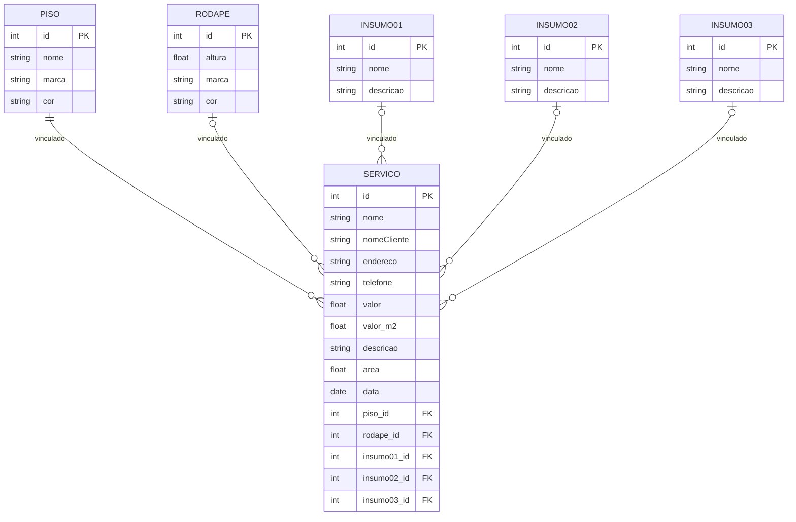

# Edis-Pisos-Gerenciar-Clientes

-banco de dados: postgresql  
-back: spring  
-front: angular  
-

```sql
CREATE TABLE piso (
    id SERIAL PRIMARY KEY,
    nome VARCHAR(100) NOT NULL,
    marca VARCHAR(100),
    cor VARCHAR(50)
);

CREATE TABLE rodape (
    id SERIAL PRIMARY KEY,
    altura DECIMAL(5,2),
    marca VARCHAR(100),
    cor VARCHAR(50)
);

CREATE TABLE insumo01 (
    id SERIAL PRIMARY KEY,
    nome VARCHAR(100) NOT NULL,
    descricao TEXT
);

CREATE TABLE insumo02 (
    id SERIAL PRIMARY KEY,
    nome VARCHAR(100) NOT NULL,
    descricao TEXT
);

CREATE TABLE insumo03 (
    id SERIAL PRIMARY KEY,
    nome VARCHAR(100) NOT NULL,
    descricao TEXT
);

CREATE TABLE servico (
    id SERIAL PRIMARY KEY,
    nome VARCHAR(100) NOT NULL,
    nome_cliente VARCHAR(150),
    endereco TEXT,
    telefone VARCHAR(20),
    valor DECIMAL(10,2),
    valor_m2 DECIMAL(10,2),
    descricao TEXT,
    area DECIMAL(10,2),
    data DATE,
    piso_id INT REFERENCES piso(id) ON DELETE SET NULL,
    rodape_id INT REFERENCES rodape(id) ON DELETE SET NULL,
    insumo01_id INT REFERENCES insumo01(id) ON DELETE SET NULL,
    insumo02_id INT REFERENCES insumo02(id) ON DELETE SET NULL,
    insumo03_id INT REFERENCES insumo03(id) ON DELETE SET NULL
);
```

